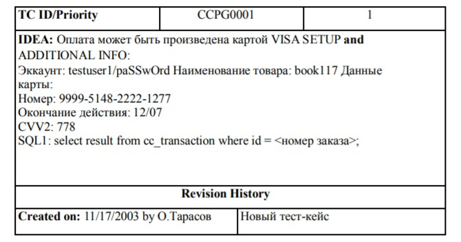
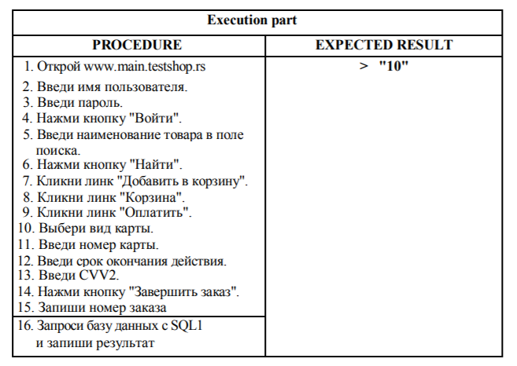
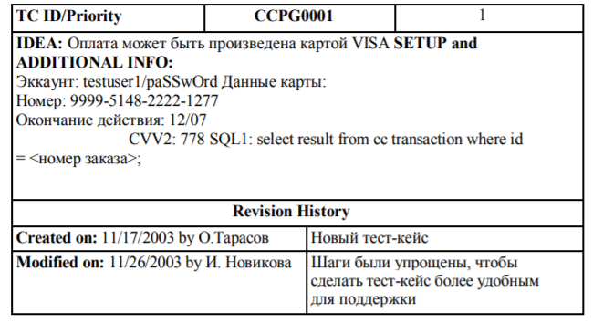

# Что есть тест-кейс?
**Тест-кейс** - проверка ПО на выполнение ожидаемых функций.

**Тест-комлект** - совокупность всех тест-кейсов некоторого ПО.

*Тест-кейс можно дословно перевести как тестируемая ситуация.*

**Главной и неотъемлемой частью тест-кейса является ожидаемый результат.**

# Структура тест-кейса
Для нахождения бага помимо ожидаемого результата необходим фактический. Как правило, при тестировании ПО необходима инструкция, как прийти к этому фактическому результату.   

**Пример правильного тест-кейса с картой:** Допустим, тестировщику А. Боброву, который только что начал работать в нашем стартапе www.testshop.rs, дали для исполнения следующий
тест-кейс:    

Шаги:
1. Открой www.main.testshop.rs
2. Введи в поле "Имя пользователя": "testuser1"
3. Введи в поле "Пароль": "pa$$wOrd"
4. Нажми кнопку "Войти"
5. Введи в поле "Поиск": "book117"
6. Нажми кнопку "Найти"
7. Кликни линк "Добавить в корзину"
8. Кликни линк "Корзина"
9. Кликни линк "Оплатить"
10. Выбери из меню "Вид карты": "VISA"
11. Введи в поле "Номер карты": "9999-5148-2222-1277"
12. Введи в поле "Действительна до": "12/07"
13. Введи в поле "CW2": "778"
14. Нажми кнопку "Завершить заказ"
15. Запиши номер заказа __________
16. Запроси базу данных:
select result from cc_transaction where id = <номер заказа >;   
Ожидаемый результат: "10"

Совокупность шагов из примера выше называется **процедурой**.

Исходя из основной компьютерной концепции ВВОД/ВЫВОД:
* шаги - интрукция для ввода
* исполнение шагов - ввод
* ожидаемый результат - ожидаемый вывод
* полученный результат - фактический вывод

**Исполнение тест-кейса завершается сравнением полученного вывода и ожидаемого**

# Полезные атрибуты тест-кейса
## Уникальный ID
ID должен быть уникален не только в рамках содержащего его документа, но и всего департамента качества.

## Приоритет тест-кейса
Это важность тест-кейса. Выражается по шкале от 1 до n, где 1 - наивысший приоритет, n (рацонально использовать 4) - наименьший.

**Пример:** тест-кейс, проверяющий работу кнопки "Купить", будет иметь приоритет 1, а тест-кейс, проверяющий цвет шрифта линка "Гостевая книга", будет 4-го приоритета.

## Идея
Это описание конкретной вещи, проверяемой тест-кейсом. В начале тест-кейса следует написать, что именно проверяется этим тест-кейсом.

## Подготовительная часть
Содержит информацию и данные, которые будут использоваться в реализации тест-кейса.

**Подготовительная часть тест-кейса может включать:**
* данные о существующем аккаунте пользователя или интрукции по созданию нового аккаунта
* другие данные, используемые в тест-кейсе, например реквизиты используемой кредитной карты
* запросы к БД, используемые в тест-кейсе
* комментарии, например о нюансах, которые могут встретиться при исполнении тест-кейса
* другие вещи, облегчающие исполнение и поддержку тест-кейса

Таким образом, подготовительная часть содержит данные, которые потом придется искать при исполнении тест-кейса.

## История редактирования
Для того, чтобы иметь сведения о рождении и истории развития каждого тест-кейса, ведется журнал изменений, где отражено: **Кто? Что? Зачем? Когда? Почему?**

Аттрибуты истории редактирования: 
* **Created on** <date> by <name> - Тест-кейс создан <дата> <кем>
* **Modified on** <date> by <name> — Тест-кейс изменен <дата> <кем>
* **Change** — Что, зачем и почему было изменено. В примерах не печатается само слово "change", а просто
заполняется значение этого атрибута в поле справа от
"Created on..." или "Modified on..."
 
**Пример:**   

# Тест-кейсы, управляемые данными
Вид тест-кейса **data-driven (буквально "управляемый данными")** характеризуется разделением и линкованием данных и интрукций по их применению, что дает возможность многократного использования тест-кейса с некоторыми модификациями для различных наборов данных.

 **Например**, изменив в тест-кейсе с картой ID тест-кейса, аттрибуты карты, идею тест-кейса и ожидаемый результат, мы можем с его помощью протестировать оплату картой Master card.

 # Поддерживаемость тест-кейса
 Интерфейс ПО часто изменяется, поэтому каждый раз вносить все изменения в тест-кейсы весьма проблематично.
 
 **Поддерживаемость** - то, насколько легко и просто можно изменить тест-кейс при изменениях в ПО.
 
 **Шаги, повторяющиеся из кейса в кейс, можно вынести во внешний документ и вместо них в тест-кейс внести один шаг-ссылку на этот документ.**
 В таком случае экономится огромное количество времени, так как шаги нужно редактировать только в одном месте.

 Итак, для улучшения поддерживаемости тест-кейса нужно:
 1. Сделать тест-кейс *data-driven*
 2. Не описывать шаги по явно очевидным сценариям (например, логин)
 3. Не давать конкретных деталей, если они не играют роли при исполнении тест-кейса (например, имя товара)
 4. Вынести во внешний документ повторяющиеся сценарии (например, 7 шагов оплаты)
 
 **Пример предыдущего тест-кейса, соответствующего указаниям выше:**
 

 

